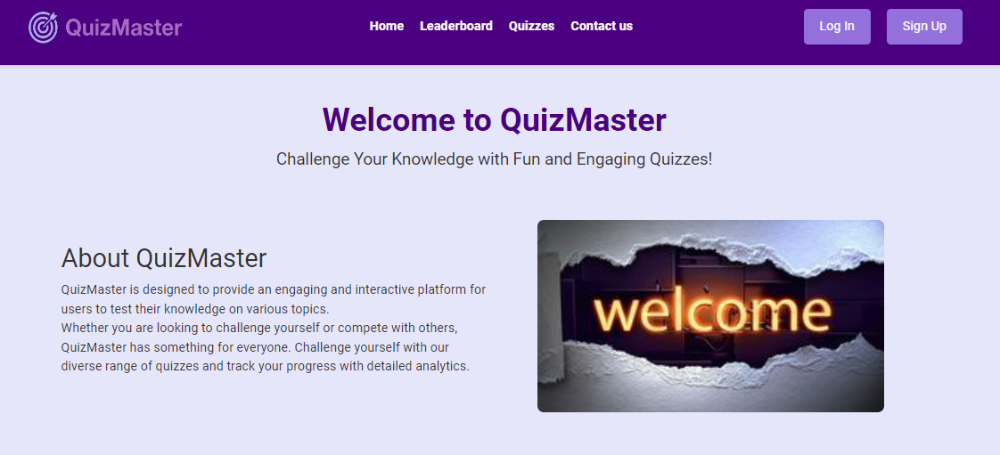
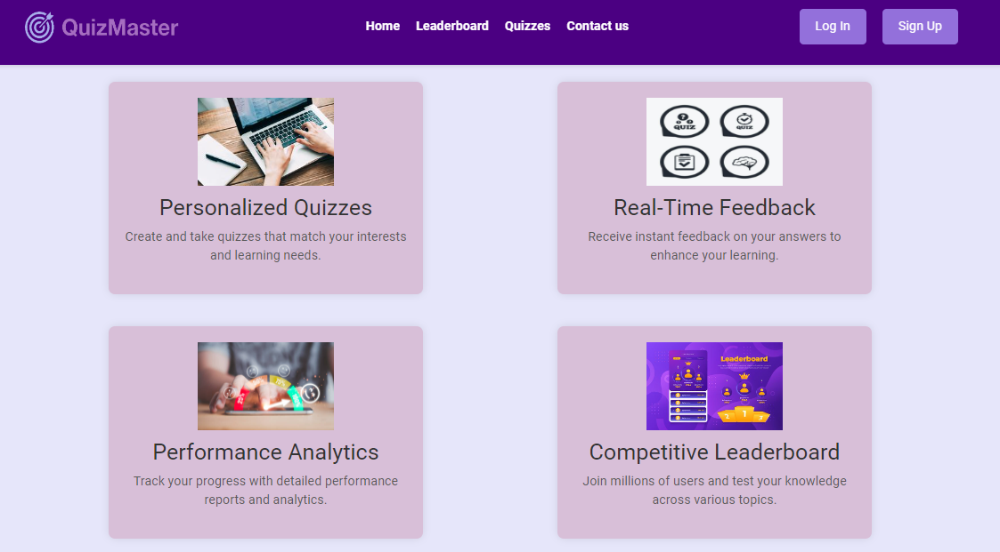
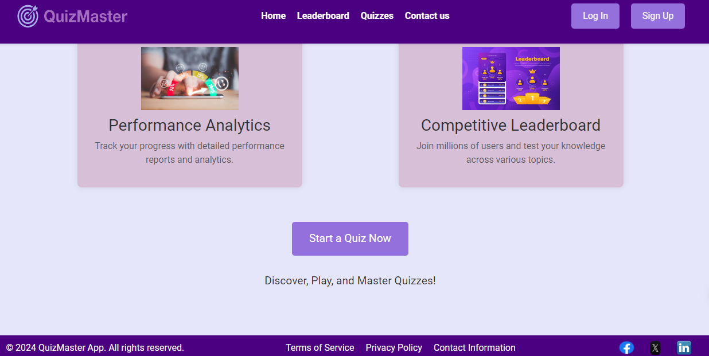
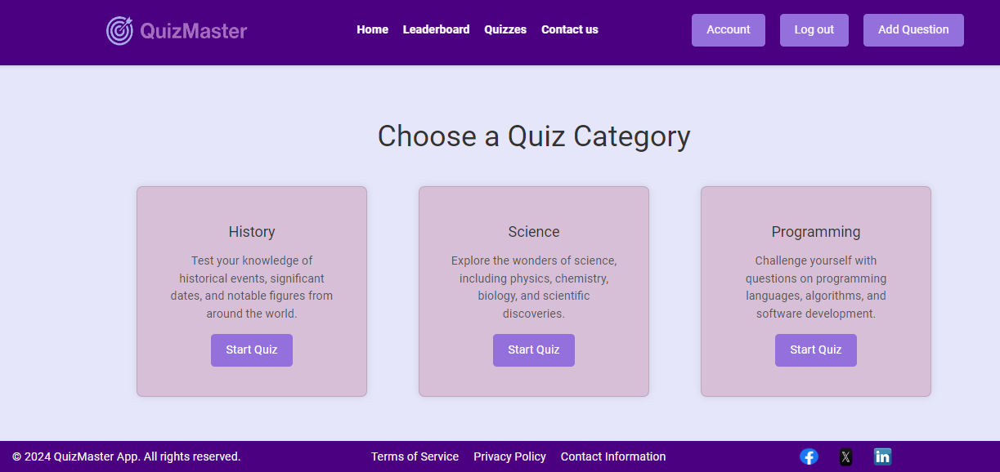

# QuizMaster App


**QuizMaster: An engaging and interactive platform to test your knowledge and track your progress.**
Creating QuizMaster has been a deeply rewarding journey fueled by a passion for learning and a drive to make it more interactive and accessible. The inspiration stemmed from a personal love for quizzes and a desire to provide a platform that combines fun with learning.

## Table of Contents

- [Introduction](#introduction)
- [Features](#features)
- [Technologies Used](#technologies-used)
- [Installation](#installation)
- [Usage](#usage)
- [Screenshots](#screenshots)
- [Contact](#contact)

## Introduction

QuizMaster is a sophisticated quiz application designed to provide an engaging and interactive experience for users. It allows users to test their knowledge on various topics, receive real-time feedback, and track their performance through detailed analytics. This project aims to offer a seamless and enjoyable way to learn and challenge oneself.
In the next iteration, we envision expanding QuizMaster with more personalized quiz recommendations, advanced analytics to track progress more comprehensively, and a competitive leaderboard to foster a sense of community and competition. Adding features like collaborative quizzes and real-time multiplayer modes are also in the pipeline.

## Features

- **Personalized Quizzes:** Create and take quizzes that match your interests and learning needs.
- **Real-Time Feedback:** Receive instant feedback on your answers to enhance your learning.
- **Performance Analytics:** Track your progress with detailed performance reports and analytics.
- **Leaderboard:** Compete with other users and see where you stand on the leaderboard.

## Technologies Used

- **Frontend:** HTML, CSS, Bootstrap
- **Backend:** Python, Flask
- **Database:** SQLite (for local development)
- **Version Control:** Git
- **Deployment:** [Heroku](https://www.heroku.com/)
- **Design:** Figma and relume for UI/UX design

### Alternatives Considered

- **Backend:** Django was considered for its robustness and built-in features, but Flask was chosen for its simplicity and flexibility.
- **Database:** PostgreSQL was considered for production use due to its scalability, but SQLite was chosen for initial development due to its ease of use and setup.

## Installation

To get a local copy up and running, follow these steps:

1. **Clone the repository:**

   ```bash
   git clone https://github.com/Aalaa-Fahim/Quiz_Master
   cd Quiz_Master
   ```

2. **Create a virtual environment and activate it:**

   ```bash
   python3 -m venv venv
   source venv/bin/activate  # On Windows use `venv\Scripts\activate`
   ```

3. **Install the required dependencies:**

   ```bash
   pip install -r requirements.txt
   ```

4. **Run the Flask application:**

   ```bash
   flask run
   ```

5. **Navigate to** `http://127.0.0.1:5000` **to see the app in action.**

## Usage

1. **Sign Up:** Create a new account to start taking quizzes.
2. **Log In:** Access your account and view your dashboard.
3. **Start a Quiz:** Choose from a variety of quizzes on different topics.
4. **Receive Feedback:** Get real-time feedback on your answers.
5. **Track Progress:** View your performance analytics and leaderboard standings.

## Screenshots

Here are some screenshots of the QuizMaster App:

### Home Page








## Contact

For any inquiries or issues, please contact:

- **Aalaa Fahim:** [GitHub Profile](https://github.com/Aalaa-Fahim) | [Linkedin](https://www.linkedin.com/in/aalaa-fahim)
- **Reham Saeed:** [GitHub Profile](https://github.com/reham128) | [Linkedin](http://www.linkedin.com/in/reham-bahaa)
